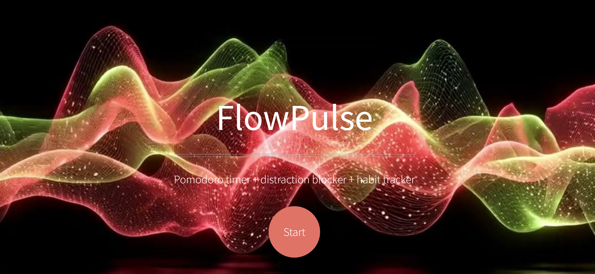

# FlowPulse

**[Live Demo → https://flow-pulse-liard.vercel.app/](https://flow-pulse-liard.vercel.app/)**

This is a customized version of the **Helios** template by HTML5 UP.  
I only edited content, styling and structure — the core design belongs to the original author.

## Original Template Information

**Helios** by HTML5 UP  
html5up.net | @ajlkn  

Free for personal and commercial use under the **CCA 3.0 license**  
→ https://html5up.net/license

Clean, modern one-page template optimized for wide screens while scaling gracefully to mobile.

**Demo images** courtesy of Michael Domaradzki (md.photomerchant.net)  
→ Not included in this repo. Do NOT download or use Michael's images without his permission.

**Credits**  
- Icons: Font Awesome (fontawesome.io)  
- JavaScript: jQuery (jquery.com)  
- Scrollex: github.com/ajlkn/jquery.scrollex  
- Responsive Tools: github.com/ajlkn/responsive-tools  

Made by AJ → aj@lkn.io | @ajlkn

## What I Changed

- Turned it into a showcase for FlowPulse concept  
- Added custom screenshot (flowchart.png)  
- Simplified sections, updated copy  
- Kept all original functionality and responsiveness

## License

The template remains under **CCA 3.0** (Creative Commons Attribution 3.0).  
You are free to use, modify and distribute this version as long as you keep the original credits and license link intact.

Do not claim the base design as your own.  
Do not resell the unmodified template.
